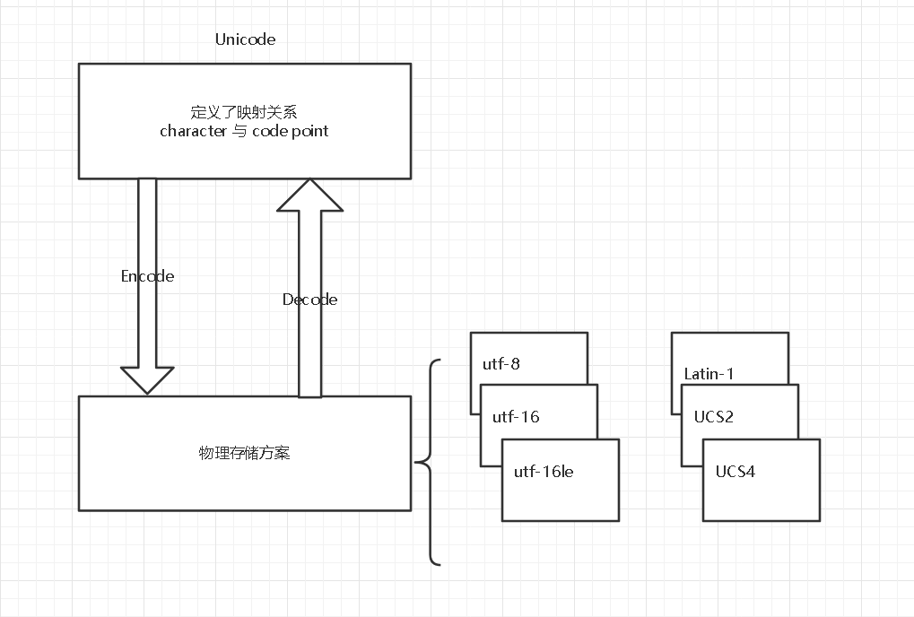

# python 字符串对象浅见

## 前言
1. 分析基于 cpython3.8.1
2. 为什么叫做浅见 
   
   - 因为自己刚入门 python
   - 因为 cpython3.8.1 中关于 Objects/unicodeobject.c 太复杂了，大约 15,000 行代码
   - 因为 python 中关于字符串历史遗留问题很多（我的建议是 python2 中编码问题能不了解就不了解，因为这是历史遗留问题，很多方式随着时间就 deprecated、甚至不再支持了）
   - 计算机编码问题本身就很复杂
   - python 中编码问题涉及很多方面，包含 unicodedata module，re module，文件读写等等


## 入门必看
1. Python 编码为什么那么蛋疼？ - 冯若航的回答 - 知乎 https://www.zhihu.com/question/31833164/answer/115069547
2. wikipedia unicode 
3. https://rushter.com/blog/python-strings-and-memory/

阅读完之后有如下结论，具体关系参考下图：

1. Unicode 实现了 字符 与 码点（即数字的对应），注意码点并不是连续的，有些码点被空了出来
   > Code points in the range U+D800–U+DBFF (1,024 code points) are known as high-surrogate code points, and code points in the range U+DC00–U+DFFF (1,024 code points) are known as low-surrogate code points. A high-surrogate code point followed by a low-surrogate code point form a surrogate pair in UTF-16 to represent code points greater than U+FFFF. <br>quote from: wikipedia unicode

2. unicode 只是人的逻辑概念，如何使用计算机存储、传输字符呢？
   
   使用 encode，将 unicode 所对应的码点进行编码
   - utf-8
     1. 优点：变长，所以对于 大多数是英文的情况下，非常节省空间
     2. 缺点：变长，所以使用索引获取第i个位置上的字符不方便
     3. 优点：不存在字节序问题
        - 参考知乎问题：为什么 UTF-8 不存在字节序的问题？
   - utf-16
     1. 缺点：由于存在字节序问题，出现了大端，小端，带BOM 三种方式

   - utf-32

   Python中判断码点最大的字符位于哪个字符集，采用定长的方案存储，对应于 PyUnicodeObject data 字段
   - latin1
     1. 优点：定长，方便索引，如果英文编程，节省空间
   - ucs2
     1. 优点：定长，方便索引
   - ucs4


## 两个函数
1. PEP 393 -- Flexible String Representation 中推荐的函数  
```PyObject* PyUnicode_New(Py_ssize_t size, Py_UCS4 maxchar);```
2. https://www.hongweipeng.com/index.php/archives/1227/  
```PyObject * PyUnicode_FromString(const char *u)```

## intern 机制
分两种情况讨论
1. 假设 ```PyObject **p```已经存在于```interned ```这个对象中，此时使用
```t = PyDict_SetDefault(interned, s, s)```就会导致```s```指针指向当前对象，
```t```指针指向``interned```这个字典中存储的对象  
显然```s```、```t```这两个指针不同
2. 假设 ```PyObject **p```已经不存在于```interned ```这个对象中，此时使用
```t = PyDict_SetDefault(interned, s, s)```就会导致```t```指针指向defalut中```s```指向的对象，  
显然```s```、```t```这两个指针相同

## 字符缓冲池
0-127之间的字符非常常用，因此使用对象缓冲池概念 
```c
static PyObject *unicode_latin1[256] = {NULL};
```

## 有一个特殊的字符串，即空串
```c
static PyObject *unicode_empty = NULL;
```

## 深入学习
- PEP 393 -- Flexible String Representation
- https://github.com/zpoint/CPython-Internals/blob/master/BasicObject/str/str_cn.md 这个里面有错误，看看就好，不建议学习
- https://zhuanlan.zhihu.com/p/104844376
- https://zhuanlan.zhihu.com/p/71200288

