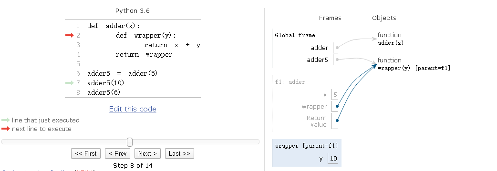

# 闭包

```python
def adder(x):
    def wrapper(y):
        return x + y
    return wrapper

adder5 = adder(5)
# 输出 15
adder5(10)
# 输出 11
adder5(6)

>>> adder.__closure__
>>> adder5.__closure__
(<cell at 0x103075910: int object at 0x7fd251604518>,)
>>> adder5.__closure__[0].cell_contents
5
```
如何理解上面的代码呢？  
请使用 http://pythontutor.com/visualize.html#mode=display 这个链接单步调试

参见如下图片，值得注意的有两点
   - adder5 指向 wrapper function[parent=f1]
   - f1(frame 1)这个栈帧执行完并没有出栈而被保留了下来

所以如果要深入理解闭包，  
只有 python code object 对象的知识是不够的，  
仍然需要 python function object 与 python frame object 的知识！！！


# 理解闭包的含义
   - https://zhuanlan.zhihu.com/p/57874441  
   - https://zhuanlan.zhihu.com/p/43623193
