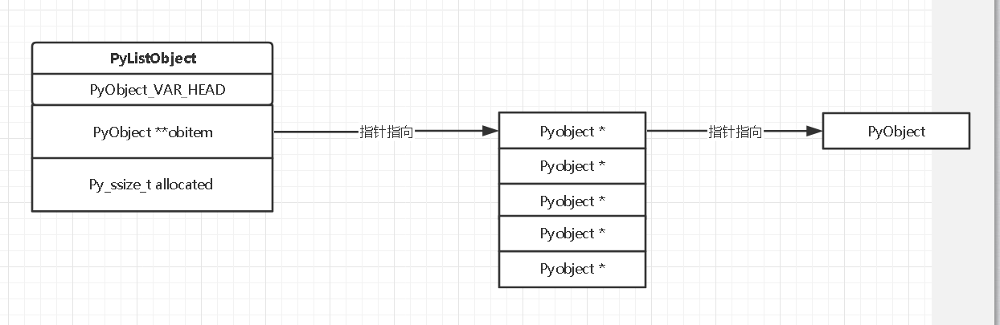

## 入门阅读
https://www.hongweipeng.com/index.php/archives/1229/

## list对象的样子
ListObject 在内存中如下图所示：
我们可以看到 
- PyListObject 本身存储一些 list 的 meta information，例如 ob_size, allocated
- 实际存储的数据由 obitem 指针所指向



## 插入元素 到 list
```C
int 
PyList_Insert(PyObject *op, Py_ssize_t where, PyObject *newitem)
```


## 删除元素 到 list
```C
static PyObject *
list_remove(PyListObject *self, PyObject *value)

{
    Py_ssize_t i;

    for (i = 0; i < Py_SIZE(self); i++) {
        /* Perform a rich comparison with integer result.  This wraps
           PyObject_RichCompare(), returning -1 for error, 0 for false, 1 for true. */
        int cmp = PyObject_RichCompareBool(self->ob_item[i], value, Py_EQ);
        if (cmp > 0) {
            if (list_ass_slice(self, i, i+1,
                               (PyObject *)NULL) == 0)
                Py_RETURN_NONE;
            return NULL;
        }
        else if (cmp < 0)
            return NULL;
    }
    PyErr_SetString(PyExc_ValueError, "list.remove(x): x not in list");
    return NULL;
}


static int
list_ass_slice(PyListObject *a, Py_ssize_t ilow, Py_ssize_t ihigh, PyObject *v)
{
    Py_ssize_t n; /* # of elements in replacement list */
    Py_ssize_t norig; /* # of elements in list getting replaced */
    Py_ssize_t d; /* Change in size */

    if (v == NULL)
        n = 0;
    norig = ihigh - ilow;
    d = n - norig;

    if (d < 0) { /* Delete -d items */
        Py_ssize_t tail;
        tail = (Py_SIZE(a) - ihigh) * sizeof(PyObject *);
        memmove(&item[ihigh+d], &item[ihigh], tail);
        if (list_resize(a, Py_SIZE(a) + d) < 0) {
            memmove(&item[ihigh], &item[ihigh+d], tail);
            memcpy(&item[ilow], recycle, s);
            goto Error;
        }
        item = a->ob_item;
    }
}  
```


## 现在考虑频繁的插入删除，在，会不会出现抖动现象
考察的就是 ```static int
list_resize(PyListObject *self, Py_ssize_t newsize)``` 这个函数
```C
list_resize(PyListObject *self, Py_ssize_t newsize)
{
    if (allocated >= newsize && newsize >= (allocated >> 1)) {
            assert(self->ob_item != NULL || newsize == 0);
            Py_SIZE(self) = newsize;
            return 0;
        }
    
    /* The growth pattern is:  0, 4, 8, 16, 25, 35, 46, 58, 72, 88, ... */
    new_allocated = (size_t)newsize + (newsize >> 3) + (newsize < 9 ? 3 : 6);
    
    if (newsize == 0)
        new_allocated = 0;
    num_allocated_bytes = new_allocated * sizeof(PyObject *);
    items = (PyObject **)PyMem_Realloc(self->ob_item, num_allocated_bytes);

    self->ob_item = items;
    Py_SIZE(self) = newsize;
    self->allocated = new_allocated;
    return 0;
}
```
答案是不会
- 假设 allocated=8，newsize=9，此时会计算出 new_allocated=16
- 假设 allocated=16，newsize=15，此时不会进行内存重新分配的任务

下降序列为 16,10,7,5,4,0
- 假设 allocated=16， newsize=7，此时会计算出 new_allocated=10
- 假设 allocated=10， newsize=4，此时会计算出 new_allocated=7
- 假设 allocated=7， newsize=2，此时会计算出 new_allocated=5
- 假设 allocated=5， newsize=1，此时会计算出 new_allocated=4
- 假设 allocated=4， newsize=0，此时会计算出 new_allocated=0


## 深入思考 切片赋值
```
>>> a = [1,2,3,4]
>>> a[1:3] = 2
Traceback (most recent call last):
  File "<stdin>", line 1, in <module>
TypeError: can only assign an iterable


# 下面这种写法 违反常识，是一种非常糟糕的写法
>>> a[1:1] = [7]
>>> a
[1, 7, 2, 3, 4]
```
虽然这是种糟糕的写法，但是为什么会这样呢？
因为切片赋值调用的就是 ```list_ass_slice``` 函数

看看这个链接即可 https://www.the5fire.com/python-slice-assignment-analyse-souce-code.html


